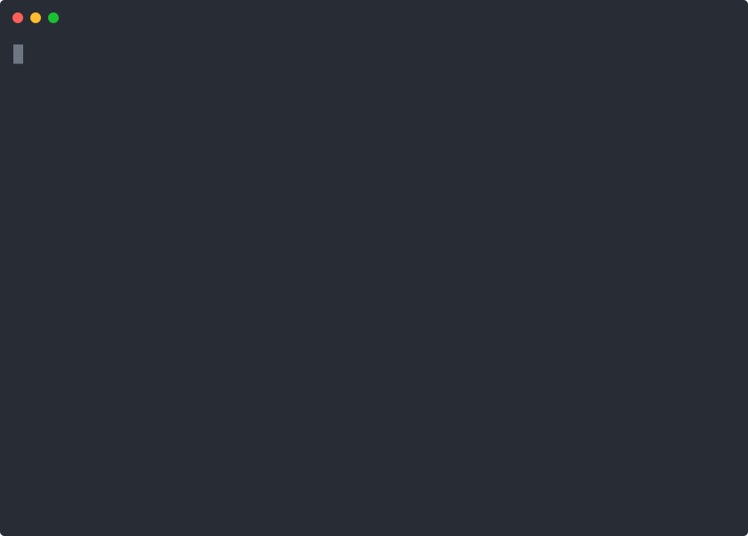

# catman

Small, no-nonsense CLI launcher and game management tool for Cataclysm.



## Features

- Supports [Cataclysm: Dark Days Ahead](https://github.com/CleverRaven/Cataclysm-DDA), [Cataclysm: Bright Nights](https://github.com/cataclysmbn/Cataclysm-BN), and [Cataclysm: The Last Generation](https://github.com/Cataclysm-TLG/Cataclysm-TLG).
- macOS support
- Download and launch games
- Manage tilesets, soundpacks, mods, and fonts
- Save and restore backups
- Preserve settings and saves between game versions

## Installation

1. Install [uv](https://docs.astral.sh/uv/getting-started/installation/).
2. Install catman:

    ```bash
    uv tool install catman
    ```

## Usage

From your terminal, run:

```bash
catman
```

catman launches an interactive shell. Use `help` to see available commands:

```
Application               
──────────────────────────
 Name   Description       
──────────────────────────
 help   Show catman help. 
 quit   Quit catman.      


Data                                      
──────────────────────────────────────────
 Name         Description                 
──────────────────────────────────────────
 backups      Manage save backups.        
 data         Manage user data directory. 
 fonts        Manage fonts.               
 mods         Manage mods.                
 soundpacks   Manage soundpacks.          
 tilesets     Manage tilesets.            


Game                                                             
─────────────────────────────────────────────────────────────────
 Name       Description                                          
─────────────────────────────────────────────────────────────────
 builds     List and manage downloaded builds.                   
 download   Download a game build.                               
 launch     Launch the active game build.                        
 status     Show current variant, channel, build, and save info. 
 variant    Switch active game variant.                          
```

### Starting from scratch

1. Select your game variant using `variant`
2. Download a version using `download`
3. Install any tilesets, soundpacks, mods, or fonts (`tilesets`, `soundpacks`, `mods`, `fonts`)
4. Launch the game with `launch`
5. Have fun!

> **Note**
>
> If you get rate limited by GitHub when downloading content, set
`GITHUB_TOKEN` in your environment.

## Todo

- Verify Linux support
- Add tests
- Add additional tilesets
- Add additional mods
- Add additional fonts
- [maybe] Add Windows support

## Developer setup

```bash
git clone https://github.com/logkirk/catman.git
cd catman
uv venv
uv pip install -e .
uv run catman
```
